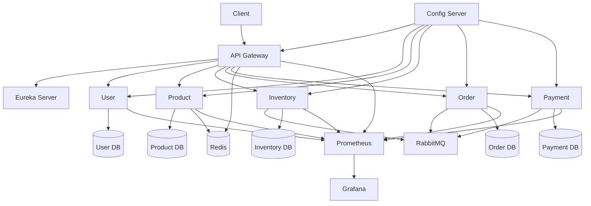

# StoreFront

<p align="center">
  
</p>

<p align="center">
  <strong>A Production-Grade E-Commerce Platform Built Using Spring Boot Microservices</strong>
</p>

<p align="center">
StoreFront demonstrates how a modern cloud-native e-commerce platform can be designed using distributed systems principles, event-driven architecture, asynchronous messaging, production-grade reliability patterns, observability, and secure API design.
</p>

---

<p align="center">


</p>

---

# Project Overview

StoreFront is a **production-oriented microservices-based e-commerce platform** designed to showcase enterprise backend architecture rather than a simple CRUD application.

The project demonstrates how distributed systems are built in real-world enterprise environments by implementing independent services, asynchronous communication, distributed transaction management, production-grade caching, centralized configuration, service discovery, observability, and secure authentication.

Unlike monolithic applications where all business capabilities are tightly coupled, StoreFront decomposes the platform into independently deployable microservices, each owning its own business domain and database.

The application is built with a strong focus on:

- Scalability
- Fault Tolerance
- High Availability
- Event-Driven Communication
- Production Readiness
- Cloud-Native Design
- Clean Architecture
- Domain Separation

The project intentionally incorporates architectural patterns commonly found in enterprise systems, including:

- API Gateway
- Service Discovery
- Database per Service
- Event-Driven Architecture
- Saga Pattern
- Transactional Outbox
- Idempotent Consumers
- Distributed Caching
- Observability
- Centralized Configuration
- JWT Authentication
- Flyway Database Versioning

Rather than demonstrating isolated technologies, StoreFront illustrates how these components work together to build a resilient, maintainable, and scalable distributed application.

---

## High-Level Architecture



---

# Business Problem

As e-commerce platforms grow, a monolithic architecture becomes increasingly difficult to maintain.

Common challenges include:

- Large deployment units
- Tight coupling between modules
- Difficult horizontal scaling
- Long deployment cycles
- Single point of failure
- Shared database bottlenecks
- Technology lock-in
- Limited fault isolation

For example, placing an order requires multiple independent business operations:

1. Validate the customer
2. Create the order
3. Reserve inventory
4. Process payment
5. Confirm the order

In a distributed system, these operations span multiple services.

Traditional ACID database transactions cannot guarantee consistency across service boundaries.

StoreFront addresses this challenge by implementing an **event-driven Saga orchestration model**, ensuring eventual consistency while allowing each service to remain autonomous.

Additionally, the platform demonstrates how enterprise applications solve real-world concerns such as:

- Reliable event publishing
- Duplicate event handling
- Distributed caching
- Database migrations
- API security
- Centralized configuration
- Runtime monitoring
- Metrics collection
- Health monitoring
- Service discovery

The result is a resilient system capable of handling failures gracefully while maintaining business consistency.

---

# Technology Stack

## Backend

| Technology | Purpose |
|------------|---------|
| Java 17 | Programming Language |
| Spring Boot 4.x | Microservices Framework |
| Spring MVC | REST APIs |
| Spring Data JPA | Data Access |
| Hibernate | ORM |
| Maven | Dependency Management |

---

# Architecture Overview

StoreFront follows a **cloud-native microservices architecture** where each service is independently deployable and owns its own database.

```text
                                +----------------------+
                                |      Client UI       |
                                +----------+-----------+
                                           |
                                           |
                                           ▼
                              +---------------------------+
                              |      API Gateway          |
                              | Spring Cloud Gateway      |
                              +------------+--------------+
                                           |
                              Service Discovery (Eureka)
                                           |
        ---------------------------------------------------------------------
        |               |               |               |                   |
        ▼               ▼               ▼               ▼                   ▼

+---------------+ +---------------+ +---------------+ +---------------+ +---------------+
| User Service  | | Product       | | Inventory     | | Order Service | | Payment       |
|               | | Service       | | Service       | |               | | Service       |
+-------+-------+ +-------+-------+ +-------+-------+ +-------+-------+ +-------+-------+
        |                 |                 |                 |                 |
        |                 |                 |                 |                 |
        ▼                 ▼                 ▼                 ▼                 ▼

 PostgreSQL       PostgreSQL       PostgreSQL       PostgreSQL       PostgreSQL


                             Asynchronous Event Bus
                    +--------------------------------------+
                    |              RabbitMQ                |
                    +--------------------------------------+

                                     ▲
                                     │
                        Transactional Outbox Pattern
                                     │
                                     ▼

                          Reliable Event Publication

                                     ▲
                                     │
                                 Redis Cache
                           (Product & Gateway)

                                     ▲
                                     │
                              Micrometer Metrics
                                     │
                                     ▼

                          Prometheus → Grafana

                                     ▲
                                     │
                           Spring Boot Actuator

```

---

## High-Level Architecture

The system consists of the following infrastructure components:

| Component | Responsibility |
|------------|----------------|
| API Gateway | Single entry point for all client requests |
| Eureka Server | Service discovery |
| Config Server | Centralized configuration management |
| RabbitMQ | Event-driven communication |
| Redis | Distributed caching and rate limiting |
| PostgreSQL | Database per microservice |
| Flyway | Database schema versioning |
| Prometheus | Metrics collection |
| Grafana | Visualization dashboards |
| Spring Boot Actuator | Health checks and operational endpoints |

---

## Architectural Principles

StoreFront is built around several core architectural principles.

### Domain-Driven Service Boundaries

Each microservice owns a specific business capability and is independently deployable.

- User Management
- Product Catalog
- Inventory
- Orders
- Payments

---

### Database Per Service

Each service maintains complete ownership of its own database schema.

Benefits include:

- Loose coupling
- Independent scaling
- Independent deployments
- Data isolation
- Better fault isolation

---

### Event-Driven Communication

Long-running business workflows are coordinated through asynchronous events instead of synchronous service chains.

Advantages include:

- Loose coupling
- Better resilience
- Improved scalability
- Eventual consistency

---

### API Gateway Pattern

All external traffic enters through the Gateway.

Responsibilities include:

- Authentication
- Authorization
- Routing
- Rate Limiting
- Request forwarding

---

### Centralized Configuration

Configuration is managed using Spring Cloud Config, ensuring consistent environment configuration across services.

---

### Service Discovery

Services dynamically register with Eureka, allowing clients to discover service instances without hardcoded endpoints.

---

### Production Observability

Operational visibility is achieved through:

- Spring Boot Actuator
- Micrometer
- Prometheus
- Grafana

---

## Cloud & Microservices

| Technology | Purpose |
|------------|---------|
| Spring Cloud Gateway | API Gateway |
| Eureka Server | Service Discovery |
| Spring Cloud Config | Centralized Configuration |
| Spring Cloud Stream | Event Messaging |
| Spring Cloud Circuit Breaker | Fault Tolerance |

---

## Messaging

| Technology | Purpose |
|------------|---------|
| RabbitMQ | Asynchronous Messaging |
| Saga Pattern | Distributed Transactions |
| Transactional Outbox | Reliable Event Publishing |
| Dead Letter Queue | Failure Recovery |
| Retry Mechanisms | Message Reliability |
| Idempotent Consumers | Duplicate Event Protection |

---

## Database

| Technology | Purpose |
|------------|---------|
| PostgreSQL 17 | Relational Database |
| Flyway | Schema Versioning |
| Spring Data JPA | Repository Layer |

---

## Caching

| Technology | Purpose |
|------------|---------|
| Redis | Distributed Cache |
| Spring Cache | Cache Abstraction |
| TTL Jitter | Cache Stampede Prevention |
| Cache Warming | Faster Startup |

---

## Security

| Technology | Purpose |
|------------|---------|
| Spring Security | Authentication & Authorization |
| JWT (RSA) | Stateless Authentication |
| BCrypt | Password Hashing |
| Gateway Security | Token Validation |

---

## Observability

| Technology | Purpose |
|------------|---------|
| Spring Boot Actuator | Operational Endpoints |
| Micrometer | Metrics Collection |
| Prometheus | Metrics Scraping |
| Grafana | Dashboards & Visualization |

---

## DevOps

| Technology | Purpose |
|------------|---------|
| Docker | Containerization |
| Docker Compose | Local Orchestration |
| Git | Version Control |

---

## Development Tools

| Technology | Purpose |
|------------|---------|
| IntelliJ IDEA | IDE |
| Postman | API Testing |
| Swagger/OpenAPI | API Documentation |
| pgAdmin | PostgreSQL Management |
| RabbitMQ Management UI | Queue Monitoring |

---

This project is designed to demonstrate enterprise backend engineering practices and production-ready microservices architecture rather than simply implementing business functionality.

# Microservices Overview

StoreFront is composed of independently deployable microservices, each responsible for a single business capability. Every service owns its own database, exposing APIs only through the API Gateway while communicating internally using both synchronous REST calls and asynchronous RabbitMQ events.

| Service | Port | Responsibility | Database |
|----------|------|----------------|----------|
| Config Server | 9030 | Centralized configuration management | - |
| Eureka Server | 8761 | Service discovery and registration | - |
| API Gateway | 9040 | API routing, authentication, rate limiting | - |
| User Service | 8081 | User registration, authentication, JWT generation | PostgreSQL |
| Product Service | 8082 | Product catalog management | PostgreSQL |
| Inventory Service | 8083 | Stock management and reservation | PostgreSQL |
| Order Service | 8084 | Order creation and orchestration | PostgreSQL |
| Payment Service | 8085 | Payment processing | PostgreSQL |

---

## Config Server

The Config Server provides centralized configuration management for all microservices.

### Responsibilities

- Externalized configuration
- Environment-specific configuration
- Central configuration repository
- Dynamic configuration loading
- Single source of configuration truth

### Benefits

- No duplicated configuration
- Easier environment management
- Simplified deployments
- Consistent service configuration

---

## Eureka Server

The Eureka Server acts as the service registry for the platform.

### Responsibilities

- Service registration
- Service discovery
- Health-aware service lookup
- Dynamic endpoint resolution

### Benefits

- No hardcoded service URLs
- Supports scaling
- Fault-tolerant service discovery
- Load-balanced communication

---

## API Gateway

The Gateway serves as the single entry point into the platform.

### Responsibilities

- Request routing
- JWT validation
- Authentication
- Authorization
- Rate limiting
- Request forwarding
- Cross-cutting concerns

### Why a Gateway?

Without a gateway, every client would need knowledge of every service endpoint.

The gateway hides internal topology while providing centralized security and routing.

---

## User Service

The User Service manages authentication and user identities.

### Responsibilities

- User registration
- Login
- Password encryption
- JWT generation
- User profile management

### Security Features

- RSA JWT signing
- BCrypt password hashing
- Spring Security
- Stateless authentication

---

## Product Service

The Product Service manages the product catalog.

### Responsibilities

- Product CRUD
- Product search
- Product categories
- Product activation/deactivation
- Product caching

### Performance Optimizations

- Redis caching
- Cache warming
- Cache eviction
- TTL randomization

---

## Inventory Service

The Inventory Service owns inventory and stock reservations.

### Responsibilities

- Stock availability
- Inventory reservation
- Inventory release
- Inventory deduction

### Reliability

- Optimistic locking
- Idempotent event processing
- Retry mechanisms
- Event-driven updates

---

## Order Service

The Order Service orchestrates the order lifecycle.

### Responsibilities

- Order creation
- Saga orchestration
- Order state management
- Compensation triggering

### Key Design Decisions

The Order Service does **not** directly modify inventory or payment data.

Instead, it coordinates the workflow through events, allowing each domain to remain autonomous.

---

## Payment Service

The Payment Service manages payment processing.

### Responsibilities

- Payment authorization
- Payment confirmation
- Payment failure handling
- Compensation events

### Design Goals

- Independent deployment
- Independent scaling
- Failure isolation
- Event-driven integration

---

# Production-Grade Features

StoreFront incorporates several enterprise architectural patterns commonly used in production systems.

## Distributed Transactions

### Saga Pattern

Traditional ACID transactions cannot span multiple microservices.

StoreFront implements the Saga Pattern to coordinate distributed business workflows while maintaining eventual consistency.

Benefits:

- No distributed database transactions
- Independent services
- Automatic compensation
- Improved fault tolerance

---

### Transactional Outbox

Publishing events immediately after database updates can lead to inconsistent state if the application crashes between the database commit and message publication.

The Transactional Outbox Pattern guarantees reliable event publishing by storing events within the same database transaction before asynchronously publishing them.

Benefits:

- Guaranteed event delivery
- No lost events
- Atomic database updates
- Reliable messaging

---

### Idempotent Consumers

Distributed messaging systems may deliver duplicate messages.

Each service tracks processed events and safely ignores duplicates.

Benefits:

- Safe retries
- Duplicate protection
- Exactly-once business processing semantics

---

### Retry Mechanism

Transient failures are automatically retried.

Typical scenarios include:

- Temporary database outages
- Network failures
- RabbitMQ interruptions

Benefits:

- Increased resiliency
- Automatic recovery
- Reduced manual intervention

---

### Dead Letter Queue (DLQ)

Messages that cannot be processed after configured retries are redirected to Dead Letter Queues.

Benefits:

- Prevents infinite retry loops
- Easier operational debugging
- Supports manual replay

---

## Data Consistency

### Optimistic Locking

Concurrent inventory updates use optimistic locking to prevent lost updates.

Benefits:

- No pessimistic database locks
- Better scalability
- Safe concurrent processing

---

### Database Per Service

Each service owns its database.

Benefits:

- Loose coupling
- Independent deployments
- Better scalability
- Domain ownership

---

### Flyway Database Versioning

Database schema changes are managed through Flyway migrations.

Benefits:

- Version-controlled schema
- Repeatable deployments
- Team collaboration
- Roll-forward migration strategy

---

## Performance

### Redis Distributed Cache

Frequently accessed data is cached to reduce database load.

Benefits:

- Lower latency
- Reduced database traffic
- Better throughput

---

### Cache Warming

Frequently requested products are preloaded into Redis during application startup.

Benefits:

- Reduced cold starts
- Faster initial responses

---

### Cache TTL Jitter

Expiration times are randomized to prevent cache stampedes.

Benefits:

- Even cache expiration
- Reduced database spikes

---

### Transaction-Aware Cache Eviction

Cache invalidation occurs only after successful database commits.

Benefits:

- Prevents stale cache
- Maintains consistency

---

## Security

### JWT Authentication

Stateless authentication using RSA-signed JWT tokens.

Benefits:

- No server session storage
- Horizontal scalability
- Secure token validation

---

### Spring Security

Role-based access control secures APIs.

Features include:

- Endpoint authorization
- Authentication filters
- Secure password storage

---

### Gateway Authentication

Authentication is centralized at the API Gateway.

Benefits:

- Single security layer
- Simplified service implementation
- Consistent authorization

---

## Messaging

### Event-Driven Architecture

Business workflows communicate through events instead of direct service dependencies.

Benefits:

- Loose coupling
- Better resilience
- Independent deployments

---

## Observability

### Micrometer

Collects application metrics.

### Prometheus

Scrapes metrics from services.

### Grafana

Visualizes dashboards.

### Spring Boot Actuator

Provides production endpoints for:

- Health
- Metrics
- Info
- Environment
- Liveness
- Readiness

---

## Infrastructure

### Docker

All services run as Docker containers.

### Docker Compose

Complete local environment provisioning with a single command.

Includes:

- PostgreSQL
- RabbitMQ
- Redis
- Prometheus
- Grafana
- All microservices

---

# Engineering Decisions

A major objective of StoreFront is to demonstrate architectural decision-making rather than simply integrating technologies.

The following sections explain why specific technologies and patterns were chosen.

---

## Why Microservices?

The platform is intentionally designed as microservices to demonstrate:

- Independent deployment
- Independent scaling
- Domain isolation
- Fault isolation
- Technology flexibility

This architecture mirrors modern enterprise backend systems.

---

## Why PostgreSQL?

PostgreSQL was selected because it offers:

- ACID compliance
- Strong transactional guarantees
- Excellent indexing
- JSON support
- Mature ecosystem

It is widely adopted in enterprise applications and well suited for transactional workloads.

---

## Why RabbitMQ?

RabbitMQ provides reliable asynchronous messaging for distributed workflows.

Reasons for choosing RabbitMQ include:

- Mature AMQP implementation
- Reliable delivery
- Dead Letter Queues
- Retry support
- Flexible routing

It enables loosely coupled communication between services.

---

## Why Saga Instead of Two-Phase Commit?

Two-Phase Commit tightly couples services and does not scale well in distributed environments.

Saga provides:

- Better scalability
- Eventual consistency
- Independent services
- Failure compensation

This approach aligns with modern microservice architecture.

---

## Why Transactional Outbox?

Simply publishing an event after committing a database transaction introduces a failure window.

The Transactional Outbox Pattern eliminates this risk by ensuring database updates and event persistence occur atomically.

This guarantees reliable event publication.

---

## Why Redis?

Redis significantly improves application performance by reducing repeated database access.

Use cases include:

- Product caching
- Gateway caching
- Frequently accessed reference data

Redis was configured with cache warming, transaction-aware eviction, and TTL jitter to address common caching challenges.

---

## Why Flyway?

Database schemas evolve over time.

Flyway provides:

- Version-controlled migrations
- Automated schema evolution
- Repeatable deployments
- Environment consistency

Each microservice manages its own schema independently.

---

## Why Spring Cloud Gateway?

The Gateway centralizes cross-cutting concerns including:

- Authentication
- Authorization
- Routing
- Rate limiting

Clients communicate only with the Gateway, simplifying API consumption and improving security.

---

## Why Eureka?

Service locations should never be hardcoded.

Eureka enables:

- Dynamic discovery
- Service registration
- Load-balanced routing
- Simplified scaling

This allows services to be added or removed without configuration changes.

---

## Why Centralized Configuration?

Managing configuration independently for each service becomes difficult as systems grow.

Spring Cloud Config provides:

- Single source of configuration
- Environment-specific properties
- Simplified deployments
- Consistent configuration management

---

## Why Observability?

Production systems require visibility into application health and behavior.

StoreFront integrates:

- Micrometer for application metrics
- Prometheus for metrics collection
- Grafana for visualization
- Spring Boot Actuator for operational endpoints

These tools enable proactive monitoring and troubleshooting.

---

## Why Event-Driven Communication?

Synchronous service chains increase latency and create tight coupling.

An event-driven architecture offers:

- Loose coupling
- Independent scaling
- Better resilience
- Fault tolerance
- Improved extensibility

It allows services to evolve independently while collaborating through well-defined business events.

---

## Design Philosophy

StoreFront was developed with the objective of demonstrating production-grade backend engineering practices rather than maximizing feature count.

Every architectural decision was evaluated against the following principles:

- Single Responsibility
- Loose Coupling
- High Cohesion
- Scalability
- Fault Tolerance
- Observability
- Maintainability
- Security
- Extensibility

The resulting platform reflects the architectural patterns, infrastructure, and operational practices commonly found in enterprise Java microservices deployed in production environments.

# Service Communication

StoreFront adopts a hybrid communication model, combining synchronous REST APIs for request/response interactions with asynchronous messaging for long-running business workflows.

This approach keeps services loosely coupled while ensuring reliable communication and eventual consistency.

---

## Communication Strategy

| Communication Type | Technology | Use Cases |
|--------------------|------------|-----------|
| Client → Gateway | HTTP/REST | External API Requests |
| Gateway → Services | HTTP/REST | Request Routing |
| Service → Service | HTTP/REST | Query Operations |
| Service → Service | RabbitMQ Events | Business Workflows |
| Service → Database | Spring Data JPA | Data Persistence |
| Service → Redis | Spring Cache | Distributed Caching |

---

## Synchronous Communication

REST communication is used where an immediate response is required.

Examples include:

- User Login
- Product Search
- Product Details
- Inventory Availability
- User Profile
- Order Status

```
Client
    │
    ▼
API Gateway
    │
    ▼
Product Service
    │
    ▼
PostgreSQL
```

### Benefits

- Simple request/response model
- Immediate client feedback
- Easy API consumption
- Suitable for read operations

---

## Asynchronous Communication

Business processes involving multiple services communicate using RabbitMQ events.

Examples include:

- Order Placement
- Inventory Reservation
- Payment Processing
- Order Confirmation
- Compensation Workflows

```
Order Service
      │
      ▼
 RabbitMQ Exchange
      │
      ▼
Inventory Service
      │
      ▼
 RabbitMQ Exchange
      │
      ▼
Payment Service
```

### Benefits

- Loose coupling
- Independent deployments
- Improved scalability
- Better resilience
- Failure recovery
- Eventual consistency

---

# Order Processing Flow

The order workflow is coordinated using the Saga Pattern.

```
Client
   │
   ▼
API Gateway
   │
   ▼
Order Service
   │
   ├──────────────► Persist Order
   │
   ├──────────────► Publish OrderCreated Event
   │
   ▼
RabbitMQ
   │
   ▼
Inventory Service
   │
   ├──────────────► Reserve Inventory
   │
   ├──────────────► Publish InventoryReserved
   │
   ▼
RabbitMQ
   │
   ▼
Payment Service
   │
   ├──────────────► Process Payment
   │
   ├──────────────► Publish PaymentCompleted
   │
   ▼
RabbitMQ
   │
   ▼
Order Service
   │
   └──────────────► Confirm Order
```

---

# Compensation Flow

If payment fails after inventory has been reserved, compensating events restore system consistency.

```
Order Created
      │
      ▼
Inventory Reserved
      │
      ▼
Payment Failed
      │
      ▼
Inventory Released
      │
      ▼
Order Cancelled
```

This ensures that no inventory remains reserved for failed orders.

---

# Event-Driven Workflow

The following events coordinate business processes across services.

| Event | Publisher | Consumer |
|--------|-----------|----------|
| OrderCreated | Order Service | Inventory Service |
| InventoryReserved | Inventory Service | Payment Service |
| InventoryReservationFailed | Inventory Service | Order Service |
| PaymentCompleted | Payment Service | Order Service |
| PaymentFailed | Payment Service | Inventory Service |
| InventoryReleased | Inventory Service | Order Service |
| OrderConfirmed | Order Service | Notification (Future) |
| OrderCancelled | Order Service | Notification (Future) |

---

# Reliability Features

The communication layer includes several production-grade reliability mechanisms.

| Feature | Purpose |
|---------|---------|
| Transactional Outbox | Reliable event publishing |
| Retry Mechanism | Automatic recovery from transient failures |
| Dead Letter Queue | Failed message handling |
| Idempotent Consumers | Prevent duplicate processing |
| Optimistic Locking | Safe concurrent inventory updates |
| Manual Acknowledgements | Reliable message consumption |

---

# Local Development Setup

## Prerequisites

Install the following software before running the application.

| Software | Recommended Version |
|-----------|---------------------|
| Java | 17 or later |
| Maven | 3.9+ |
| Docker Desktop | Latest |
| Docker Compose | Latest |
| Git | Latest |
| IntelliJ IDEA | Community / Ultimate |
| Postman | Latest |

---

## Clone the Repository

```bash
git clone https://github.com/<your-username>/StoreFront.git

cd StoreFront
```

---

## Project Structure

```
StoreFront
│
├── config-server
├── eureka-server
├── gateway-server
├── user-service
├── product-service
├── inventory-service
├── order-service
├── payment-service
│
├── storefront-config
│
├── docker
│
├── docs
│
└── README.md
```

---

## Build the Project

Build all services before starting Docker.

```bash
mvn clean install
```

or skip tests during local development.

```bash
mvn clean install -DskipTests
```

---

## 📚 Documentation

Detailed documentation for running the project locally with IDE.

| Document | Description |
|----------|-------------|
| [DEVELOPMENT](DEVELOPMENT_README.md) | For local developement with IDE refer this markdown file|


---

# Docker Compose [For overall testing, demonstrating and deployment]

StoreFront uses Docker Compose to provision the complete local development environment.

The compose file starts all required infrastructure components and application services.

Infrastructure includes:

- PostgreSQL
- RabbitMQ
- Redis
- Prometheus
- Grafana

Application services include:

- Config Server
- Eureka Server
- API Gateway
- User Service
- Product Service
- Inventory Service
- Order Service
- Payment Service

---

## Start the Environment

```bash
docker compose up -d
```

---

## Build and Start

```bash
docker compose up --build -d
```

---

## Stop the Environment

```bash
docker compose down
```

---

## Stop and Remove Volumes

```bash
docker compose down -v
```

---

## View Running Containers

```bash
docker ps
```

---

## View Logs

View logs for a specific service.

```bash
docker logs storefront-product-service
```

Follow logs continuously.

```bash
docker logs -f storefront-order-service
```

---

# Infrastructure Services

| Component | URL |
|-----------|-----|
| Eureka Dashboard | http://localhost:9035 |
| RabbitMQ Management | http://localhost:15672 |
| Prometheus | http://localhost:9090 |
| Grafana | http://localhost:3000 |
| API Gateway | http://localhost:9040 |

---

# Running the Application

Once Docker Compose is running, verify services in the following order.

---

## Step 1

Verify Config Server

```
http://localhost:9030/actuator/health
```

Expected Response

```json
{
  "status": "UP"
}
```

---

## Step 2

Verify Eureka Server

```
http://localhost:8761
```

Confirm that all services have successfully registered.

---

## Step 3

Verify Gateway

```
http://localhost:9040/actuator/health
```

---

## Step 4

Verify Service Registration

The Eureka dashboard should list:

- CONFIG-SERVER
- GATEWAY-SERVER
- USER-SERVICE
- PRODUCT-SERVICE
- INVENTORY-SERVICE
- ORDER-SERVICE
- PAYMENT-SERVICE

---

## Step 5

Verify PostgreSQL

Confirm that each microservice database has been created.

Example:

```
sf_user
sf_product
sf_inventory
sf_order
sf_payment
```

---

## Step 6

Verify Flyway

Check service startup logs for successful Flyway migration.

Example:

```
Successfully applied 5 migrations.
```

---

## Step 7

Verify RabbitMQ

Open the RabbitMQ Management Console.

```
http://localhost:15672
```

Confirm:

- Exchanges
- Queues
- Bindings
- Consumers

are correctly created.

---

## Step 8

Verify Redis

Use Redis CLI or RedisInsight.

Example:

```bash
redis-cli
```

```bash
KEYS *
```

Cached product entries should appear after product requests.

---

## Step 9

Verify Prometheus

```
http://localhost:9090
```

Ensure all services are being scraped successfully.

---

## Step 10

Verify Grafana

```
http://localhost:3000
```

Open the dashboards and confirm metrics are displayed.

---

# Application Startup Order

For manual execution (without Docker Compose), start services in the following sequence.

1. PostgreSQL
2. RabbitMQ
3. Redis
4. Config Server
5. Eureka Server
6. User Service
7. Product Service
8. Inventory Service
9. Payment Service
10. Order Service
11. API Gateway

---

# Smoke Test

After the application is running, verify the following workflow.

- Register a user
- Authenticate and obtain JWT
- Create a product
- Search products
- Create inventory
- Place an order
- Verify inventory deduction
- Verify payment processing
- Confirm order status
- Observe events in RabbitMQ
- View metrics in Grafana

If all steps succeed, the platform is functioning correctly.

---

# Troubleshooting

## Service Not Registered

Verify:

- Config Server is running
- Eureka Server is running
- Service configuration is correct

---

## RabbitMQ Connection Issues

Check that RabbitMQ is healthy.

```bash
docker ps
```

Restart if necessary.

```bash
docker compose restart rabbitmq
```

---

## Redis Cache Not Working

Verify Redis container.

```bash
docker exec -it storefront-redis redis-cli
```

Check cached keys.

```bash
KEYS *
```

---

## Flyway Migration Failure

Ensure databases exist before services start.

If using Docker volumes from a previous run, remove them and recreate the environment.

```bash
docker compose down -v
docker compose up --build
```

---

## Service Health

Each microservice exposes Spring Boot Actuator health endpoints.

Example:

```
http://localhost:8080/actuator/health
```

Expected response:

```json
{
  "status": "UP"
}
```

# Monitoring & Observability

StoreFront includes a production-oriented observability stack to provide visibility into application health, performance, resource utilization, and business operations.

The monitoring infrastructure is built using:

- Spring Boot Actuator
- Micrometer
- Prometheus
- Grafana

This enables proactive monitoring, faster troubleshooting, and operational insights across all microservices.

---

## Monitoring Architecture

```text
                 +----------------------+
                 |  Spring Boot Apps    |
                 +----------+-----------+
                            |
                      Micrometer Metrics
                            |
                            ▼
                   Spring Boot Actuator
                            |
                            ▼
                     Prometheus Server
                            |
                            ▼
                     Grafana Dashboards
```

---

## Spring Boot Actuator

Every microservice exposes production-ready operational endpoints.

### Common Endpoints

| Endpoint | Description |
|----------|-------------|
| `/actuator/health` | Service health |
| `/actuator/info` | Application information |
| `/actuator/metrics` | Available metrics |
| `/actuator/prometheus` | Prometheus metrics |
| `/actuator/env` | Environment properties |
| `/actuator/beans` | Spring Beans |
| `/actuator/mappings` | Request mappings |

Example:

```
http://localhost:8080/actuator/health
```

Expected Response

```json
{
  "status": "UP"
}
```

---

## Micrometer Metrics

Micrometer serves as the metrics facade for all services.

### Metrics Collected

### JVM Metrics

- Heap Memory
- Non-Heap Memory
- Garbage Collection
- Thread Count
- Class Loading

---

### HTTP Metrics

- Request Count
- Request Duration
- Response Status
- Error Rate
- Active Requests

---

### System Metrics

- CPU Usage
- Disk Usage
- Process Uptime
- File Descriptors

---

### Business Metrics

Examples include:

- Products Created
- Products Updated
- Orders Created
- Orders Confirmed
- Inventory Reserved
- Payments Processed

---

## Prometheus

Prometheus periodically scrapes metrics exposed by each microservice.

### Access

```
http://localhost:9090
```

### Responsibilities

- Metrics Collection
- Time-Series Storage
- Metric Queries
- Alert Rule Evaluation

---

## Grafana

Grafana provides visualization dashboards for collected metrics.

### Access

```
http://localhost:3000
```

### Dashboard Categories

- JVM Dashboard
- Spring Boot Dashboard
- HTTP Metrics
- Business Metrics
- Infrastructure Metrics

---

## Health Monitoring

Health endpoints verify the status of application dependencies.

Typical checks include:

- Database Connectivity
- Redis Connectivity
- RabbitMQ Connectivity
- Disk Space
- Application Readiness

---

## Monitoring URLs

| Component | URL |
|-----------|-----|
| Prometheus | http://localhost:9090 |
| Grafana | http://localhost:3000 |
| Eureka | http://localhost:9035 |
| RabbitMQ | http://localhost:15672 |
| Gateway Health | http://localhost:9040/actuator/health |

---

# API Documentation

StoreFront exposes RESTful APIs documented using OpenAPI (Swagger).

Each microservice provides interactive API documentation that can be used for development, testing, and integration.

---

## Swagger UI

| Service | Swagger URL |
|----------|-------------|
| User Service | http://localhost:8080/swagger-ui.html |
| Product Service | http://localhost:8090/swagger-ui.html |
| Inventory Service | http://localhost:9000/swagger-ui.html |
| Order Service | http://localhost:9010/swagger-ui.html |
| Payment Service | http://localhost:9020/swagger-ui.html |

---

## OpenAPI Specification

Each service also exposes its OpenAPI definition.

Example:

```
http://localhost:9040/v3/api-docs
```

---

## Primary APIs

### User Service

- User Registration
- Login
- JWT Token Generation
- User Profile

---

### Product Service

- Create Product
- Update Product
- Delete Product
- Search Products
- Product Details

---

### Inventory Service

- Inventory Creation
- Stock Reservation
- Stock Release
- Inventory Lookup

---

### Order Service

- Create Order
- Order Status
- Order History
- Order Confirmation

---

### Payment Service

- Process Payment
- Payment Status
- Payment History

---

## Authentication

Protected endpoints require a valid JWT token.

Example:

```http
Authorization: Bearer <JWT_TOKEN>
```

---

## HTTP Status Codes

| Status | Meaning |
|----------|---------|
| 200 | Success |
| 201 | Resource Created |
| 204 | No Content |
| 400 | Bad Request |
| 401 | Unauthorized |
| 403 | Forbidden |
| 404 | Resource Not Found |
| 409 | Conflict |
| 500 | Internal Server Error |

---

# Screenshots

The following screenshots demonstrate various components of the platform.

> **Note:** Replace the placeholder images with actual screenshots after deployment.

---

## System Architecture


---

## Eureka Dashboard


---

## Swagger UI


---

## RabbitMQ Management


---

## Prometheus


---

## Grafana Dashboard


---

## Product APIs


---

## Order Processing


---

## Docker Containers


---

## Redis Cache


---

# Future Roadmap

Although StoreFront already demonstrates numerous production-grade patterns, several enhancements can further extend the platform.

---

## Cloud Native Deployment

- Kubernetes Deployment
- Helm Charts
- Horizontal Pod Autoscaling
- Ingress Controller
- Service Mesh

---

## Security Enhancements

- OAuth2
- OpenID Connect
- Keycloak Integration
- API Keys
- Multi-Factor Authentication

---

## Observability

- OpenTelemetry
- Distributed Tracing
- Jaeger
- Zipkin
- Centralized Logging (ELK Stack)

---

## Business Features

- Shopping Cart
- Wishlist
- Coupons
- Discounts
- Product Reviews
- Ratings
- Notifications
- Email Service
- SMS Service

---

## Search

- Elasticsearch
- Full Text Search
- Auto Suggestions
- Faceted Search

---

## Performance

- Redis Cluster
- Redis Bloom Filters
- CDN Integration
- Read Replicas
- Database Sharding

---

## Infrastructure

- GitHub Actions
- Jenkins Pipeline
- Terraform
- AWS Deployment
- Azure Deployment

---

## Advanced Messaging

- Event Replay
- Event Sourcing
- CQRS
- Kafka Support

---

## Artificial Intelligence

- Product Recommendation Engine
- Personalized Search
- Customer Insights
- Demand Forecasting

---

# Learning Outcomes

This project demonstrates practical experience with modern backend engineering concepts, including:

- Microservices Architecture
- Event-Driven Systems
- Distributed Transactions
- Saga Pattern
- Transactional Outbox
- Idempotent Consumers
- Spring Boot
- Spring Cloud
- RabbitMQ
- Redis
- PostgreSQL
- Flyway
- Spring Security
- JWT Authentication
- Docker
- Observability
- Metrics
- Production Readiness

---

# Acknowledgements

StoreFront was developed as a portfolio project to demonstrate production-grade backend engineering practices using the Spring ecosystem and modern microservices architecture.

The project focuses on applying enterprise software design principles, distributed systems patterns, and cloud-native technologies to solve real-world e-commerce challenges.